**Proyecto “Aplicativo Movil Juegos Florales”**

## Introducción
### Propósito

El propósito de nuestro proyecto es desarrollar un aplicativo móvil que facilite la inscripción y gestión de equipos participantes en los juegos de actividades florales universitarias, optimizando los procesos actuales y promoviendo una mayor participación estudiantil.

### Alcance

Desarrollar una solución tecnológica que permita a los equipos universitarios registrarse de manera autónoma, acceder a información relevante de los juegos, y recibir notificaciones sobre eventos, todo ello a través de una plataforma móvil accesible y fácil de usar.

### Definición siglas y abreviaturas

- App: Aplicación móvil, un software diseñado específicamente para dispositivos móviles como teléfonos inteligentes y tabletas, que permite a los usuarios interactuar con diversas funcionalidades de manera sencilla y eficiente.
- UI (Interfaz de Usuario): Es la parte visual del sistema que permite a los usuarios interactuar con la aplicación, incluyendo botones, menús, formularios y otros elementos gráficos diseñados para ofrecer una experiencia intuitiva y accesible.
- UX (Experiencia de Usuario): Hace referencia a la percepción y satisfacción del usuario al interactuar con la aplicación, englobando aspectos como facilidad de uso, funcionalidad y estética.
- API (Interfaz de Programación de Aplicaciones): Conjunto de reglas y protocolos que permiten que diferentes aplicaciones o componentes del sistema se comuniquen entre sí, facilitando la integración de servicios externos o funcionalidades adicionales al aplicativo móvil.

### Referencias

- Guías de diseño de interfaces móviles (Google Material Design, Human Interface Guidelines).
- Estudios previos de gestión tecnológica en eventos estudiantiles.
- Documentación técnica de herramientas de desarrollo móvil como Flutter y React Native.

### Visión General

- La visión que tenemos de nuestro sistema web, es que va a resultar innovadora al utilizar la APIS como escala, para la inscripción de equipos en los juegos de actividades florales universitarias. Se presentan el propósito, el alcance, los términos clave y las referencias relevantes, así como una visión detallada de los objetivos y características principales del sistema.

## **Representación Arquitectónica**

1. Escenarios:

1. Requerimientos Funcionales

|**ID**|**Requerimiento**|**Descripción**|
| -: | :- | :-: |
|RF1|Autenticación y Usuarios|
- Inicio de sesión mediante cuentas Microsoft

- Roles diferenciados (administrador y usuario estándar)

- Cierre de sesión seguro
|
|RF2|Gestión de Eventos
|
- Crear, editar, eliminar y visualizar eventos

- Asignar fechas y ubicaciones a eventos

- Gestionar estados de eventos
|
|RF3|Gestión de Participantes
|
- Registro y administración de participantes

- Asignación de participantes a eventos

- Control de información personal
|
|RF4|Gestión de Equipos
|
- Crear y administrar equipos

- Asignar participantes a equipos

- Vincular equipos con eventos
|
|RF5|Gestión de Ubicaciones
|
- Registro de ubicaciones para eventos.

- Detalles y disponibilidad de espacios.

- Asignación de ubicaciones a eventos
|

1. Requerimientos No Funcionales - Atributos de Calidad

|**ID**|**Requerimiento**|**Descripción**|
| :-: | :-: | :-: |
|

RNF1
|

Seguridad
|
- Autenticación segura con Microsoft

- Protección de datos personales

- Control de acceso basado en roles
|
|

RNF2
|

Usabilidad
|
- Interfaz intuitiva y responsive

- Tiempos de respuesta rápidos

- Diseño adaptable a diferentes dispositivos
|
|

RNF3
|

Rendimiento
|
- Carga rápida de datos

- Optimización de recursos

- Manejo eficiente de la memoria
|
|

RNF4
|

Mantenibilidad
|
- Código modular y documentado

- Facilidad de actualización

- Gestión de versiones
|

1. Restricciones

- Disponibilidad de datos: El sitio depende de la disponibilidad y precisión de los datos sobre lugares, equipos a competir.

- Acceso a internet: Los usuarios deben tener acceso a una conexión a internet para utilizar todas las funcionalidades del sitio, especialmente la visualización de mapas y la búsqueda en tiempo real.
- Precisión de la información: La calidad de la información proporcionada, como horarios de apertura y tarifas, depende de la actualización y precisión de las fuentes de datos utilizadas.
- Integración con servicios externos: La integración con proveedores de servicios externos, como sistemas de transporte público, puede estar sujeta a restricciones técnicas o de colaboración.

1. ## **Representación de la Arquitectura del Sistema**

1. Vista de Caso de Uso:

3\.1.1. Diagramas de Casos de Uso

1. Vista Lógica

1. Diagrama de Subsistemas (paquetes)

1. Diagrama de Secuencia (vista de diseño)

RF1: Autenticación y Usuarios

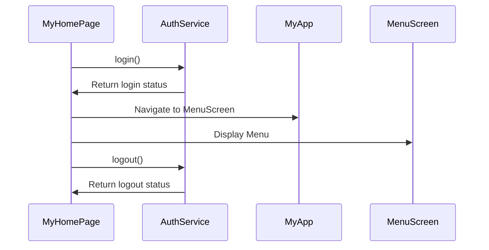

RF2: Gestión de Eventos

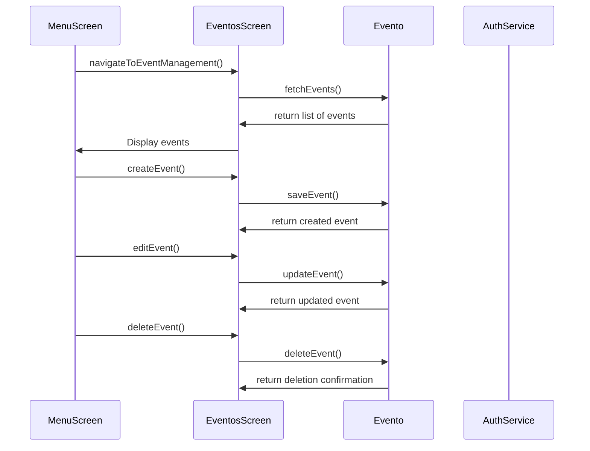

RF3: Gestión de Participantes

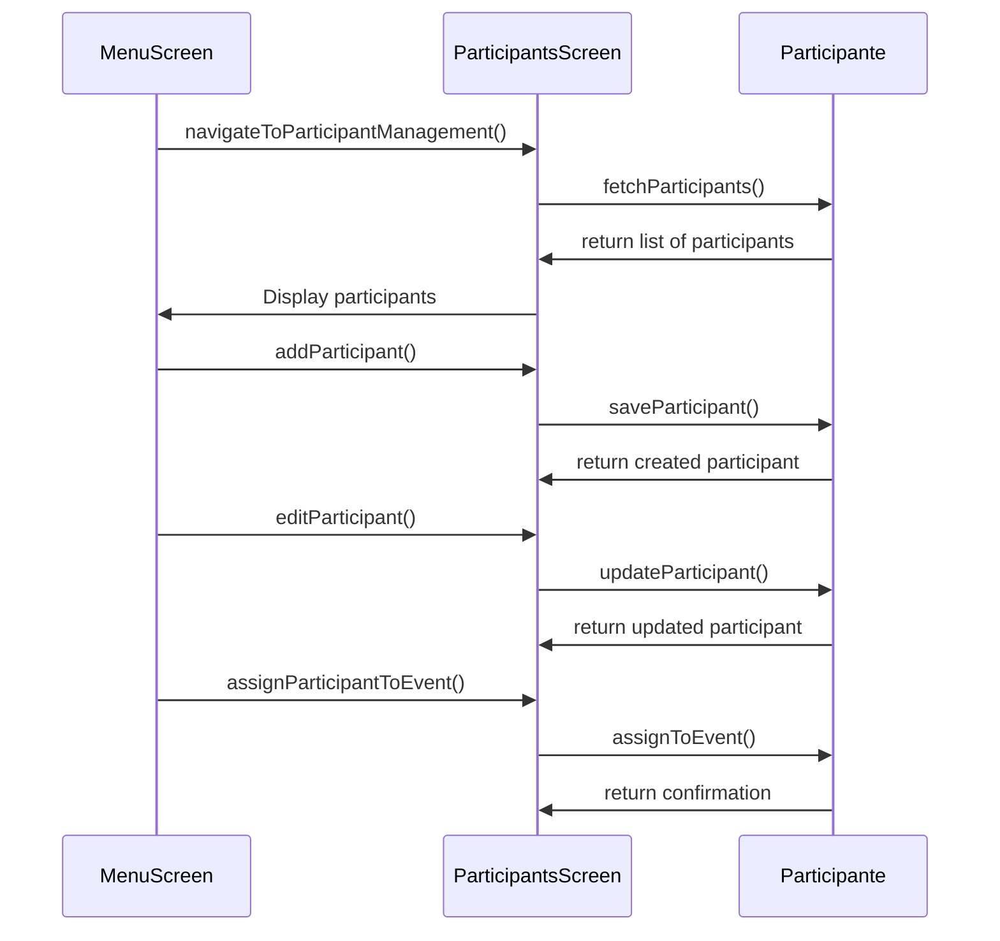

RF4: Gestión de Equipos

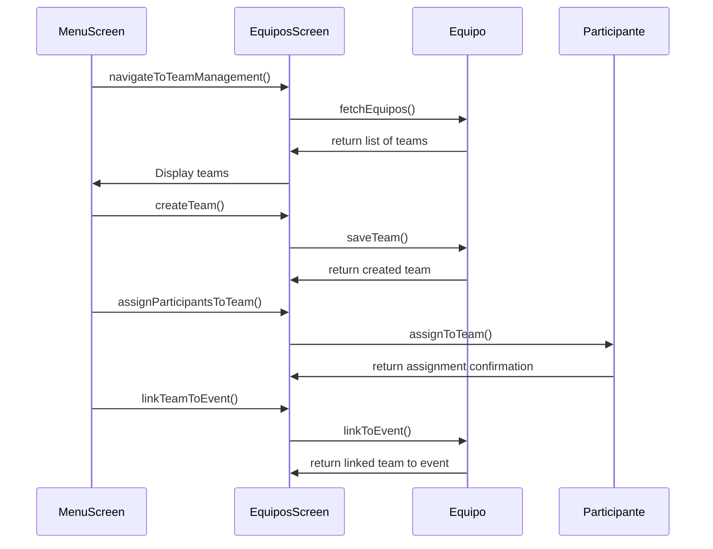

RF5: Gestión de Ubicaciones

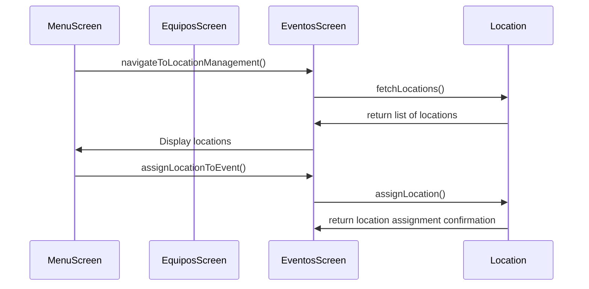

1. Diagrama de Colaboración (vista de diseño)

Requerimiento RF-1: Iniciar Sesión
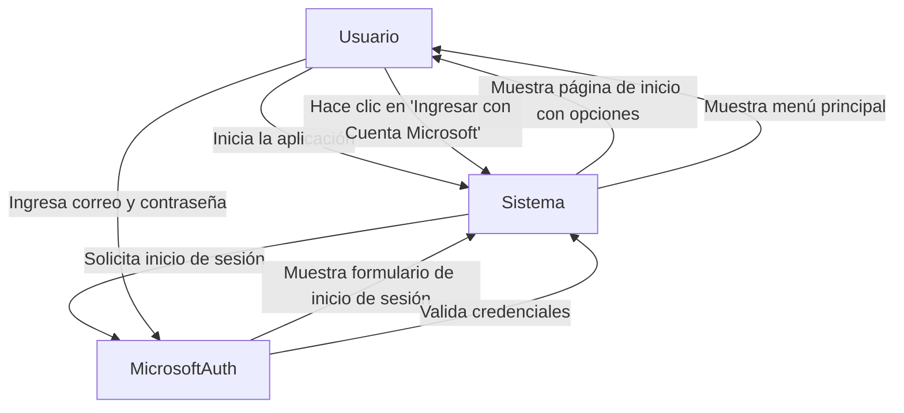

Requerimiento RF-2: Visualizar Eventos
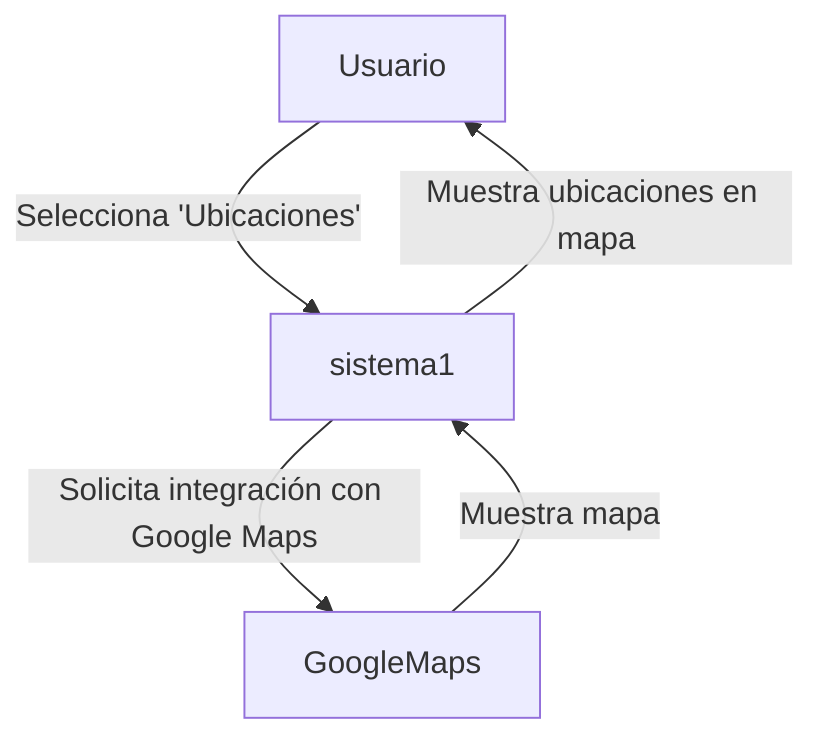

Requerimiento RF-4: Visualizar Equipos
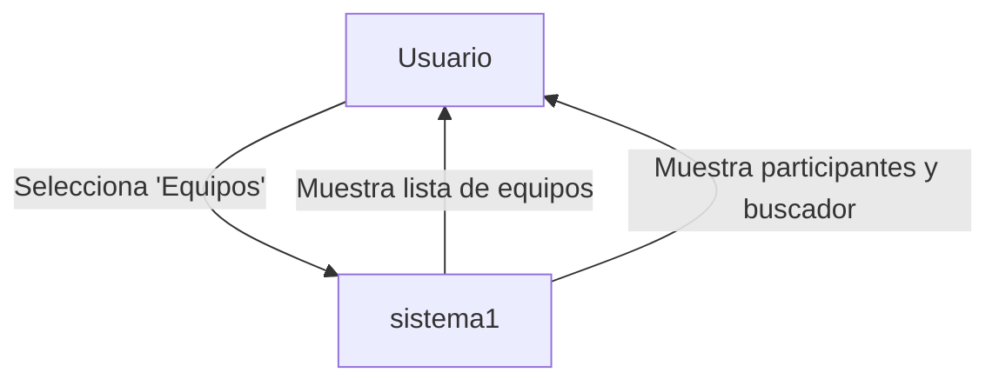

Requerimiento RF-5: Visualizar Participantes
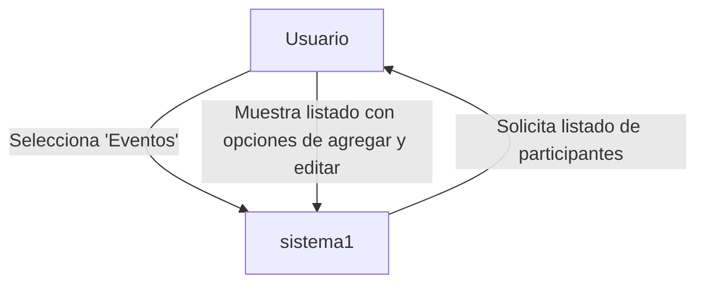

Requerimiento RF-6: Visualizar Coordinadores Docentes
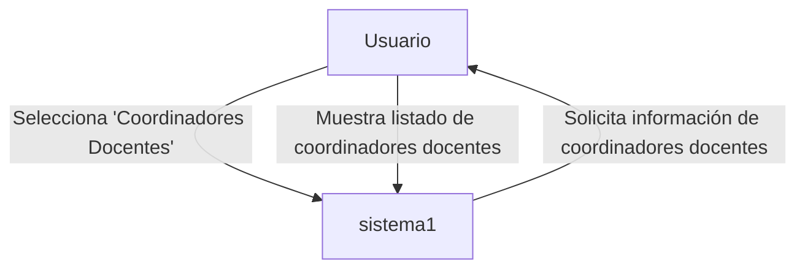

Requerimiento RF-7: Visualizar Coordinadores Estudiantes

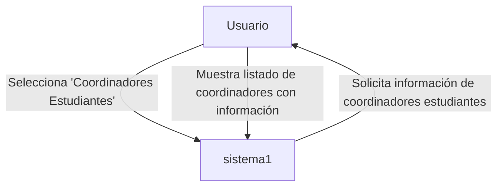

1. Diagrama de Objetos

1. Diagrama de Clases

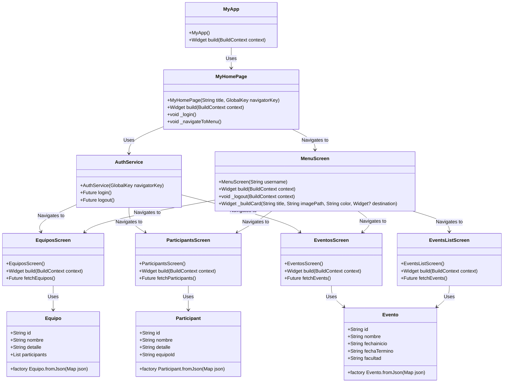

1. Diagrama de Base de Datos

1. Vista de Implementación: (vista de desarrollo)

1. Diagrama de Arquitectura de Software

1. Diagrama	de	Arquitectura	del	Sistema	(diagrama	de componentes)

1. Vista de Procesos:

3\.4.1.	Diagrama	de	Procesos	del	Sistema	(diagrama	de actividades)

1. Visto de Despliegue: (vista física)

3\.5.1 Diagrama de Despliegue

Para mas informacion consultar el siguiente repositorio: https://github.com/UPT-FAING-EPIS/proyecto-si8811a-2024-ii-u1-desarrollo-api-back

1. ## **Atributos de Calidad del Software**

Escenario de Funcionalidad:

| Item | Descripcion|
|------------|-------------------------------------------------------------------------|
| Fuente     | Usuario                                                                 |
| Estímulo   | Necesidad de inscribir equipos, consultar información, visualizar ubicaciones y puntajes |
| Artefacto  | Aplicativo móvil (aplicación o software móvil)                           |
| Entorno    | Entorno digital                                                         |
| Respuesta  | El sistema debe permitir la inscripción de equipos, consulta de actividades, visualización de datos, y seguimiento |
| Medición   | Evaluar si la app permite registrar equipos, mostrar actividades, ubicaciones, y estadísticas correctamente y sin errores |

Escenario de Usabilidad:

| Item | Descripcion|
|------------|-------------------------------------------------------------------------|
| Fuente     | Usuario                                                                 |
| Estímulo   |Necesidad de navegar la app de manera intuitiva|
| Artefacto  | Aplicativo móvil (aplicación o software móvil)                           |
| Entorno    | Entorno digital                                                         |
| Respuesta |El sistema debe ser fácil de navegar, con menús y opciones claras y accesibles.|
| Medición   |Evaluar si los usuarios sin experiencia técnica pueden completar tareas sin dificultad.|

Escenario de Confiabilidad:

| Item | Descripcion|
|------------|-------------------------------------------------------------------------|
| Fuente     | Usuario                                                                 |
| Estímulo   |Necesidad de realizar registros, consultas y actualizaciones sin errores|
| Artefacto  | Aplicativo móvil (aplicación o software móvil)                           |
| Entorno    | Condiciones de evento en tiempo real, con múltiples usuarios activos|
| Respuesta |El sistema debe registrar y consultar datos sin fallos, incluso en momentos de alta carga de usuarios|
| Medición   |Medir la tasa de errores en el registro, consulta y actualización de datos durante el evento|

Escenario de Rendimiento:

Escenario de Mantenibilidad:

