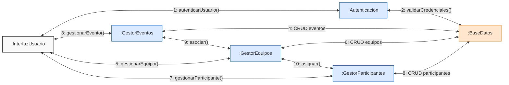
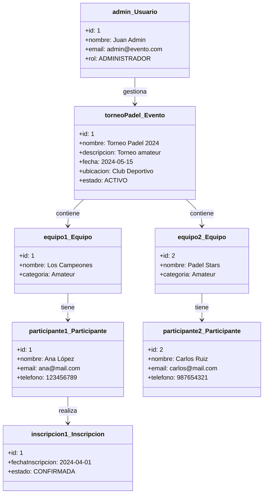
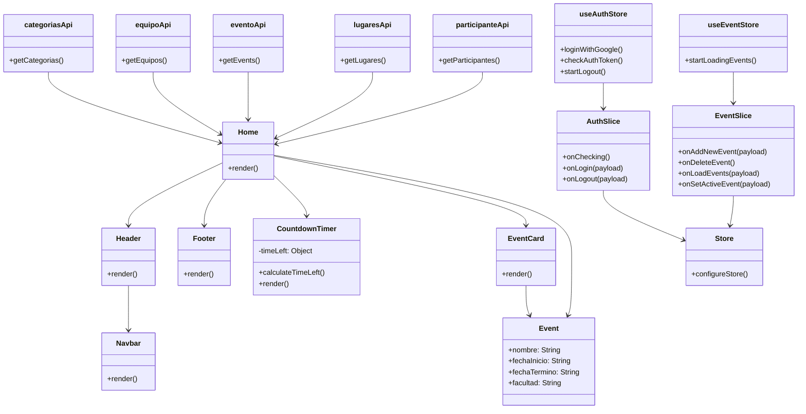
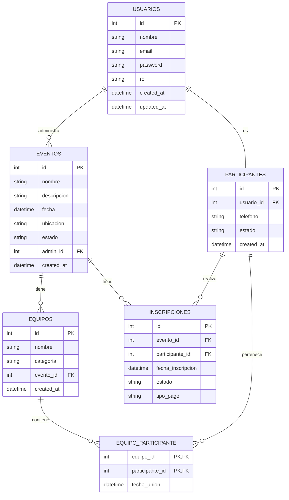

# Proyecto Sistema Web para los Juegos Florales UPT

## 1. Introducción

### Propósito (Diagrama 4+1)
El propósito de la plataforma web es ofrecer una solución moderna, eficiente y responsiva para la gestión de los Juegos Florales. Basado en el modelo 4+1, este diseño incluye:
- **Vista Lógica**: Una interfaz dinámica desarrollada con React y Tailwind CSS.
- **Vista de Implementación**: Almacenamiento y escalabilidad mediante Amazon S3.
- **Vista de Procesos**: Integridad y disponibilidad de datos en tiempo real.
- **Vista Física**: Despliegue en la nube con recursos escalables.
- **Vista de Casos de Uso**: Gestión de datos eficiente para actividades de registro y consulta.

### Alcance
Incluye el diseño e implementación de:
- Interfaz moderna con React y Tailwind CSS.
- Backend robusto en Amazon S3, asegurando alta disponibilidad y seguridad.

### Definición, Siglas y Abreviaturas
| Sigla | Nombre                        | Definición                                                                                 |
|-------|-------------------------------|-------------------------------------------------------------------------------------------|
| CU    | Caso de Uso                   | Conjunto de eventos entre un actor y el sistema para completar un proceso.                |
| RF    | Requerimiento Funcional       | Interacciones entre el sistema y su entorno, como usuarios o procesos automáticos.        |
| RNF   | Requerimiento No Funcional    | Criterios que evalúan la operación del sistema más allá de sus comportamientos específicos.|

### Organización del Documento
1. **Introducción**: Propósito, alcance y conceptos clave del proyecto.
2. **Objetivos y Restricciones Arquitectónicas**: Detalle de requisitos funcionales y no funcionales.
3. **Representación de la Arquitectura del Sistema**: Diagramas de vistas del sistema.
4. **Atributos de Calidad del Software**: Escenarios de funcionalidad, usabilidad, rendimiento, entre otros.

---

## 2. Objetivos y Restricciones Arquitectónicas

### Requerimientos Funcionales
| ID   | Nombre                      | Descripción                                                                             | Prioridad |
|------|-----------------------------|-----------------------------------------------------------------------------------------|-----------|
| RF1  | Registro de Usuarios        | Permitir que los estudiantes se registren en la plataforma con sus datos personales.   | Alta      |
| RF2  | Inscripción en Actividades  | Inscribir a estudiantes en actividades de los Juegos Florales.                         | Alta      |
| RF3  | Configuración de Eventos    | Organizar eventos y categorías en la plataforma.                                       | Alta      |
| RF4  | Publicación del Cronograma  | Mostrar cronogramas de actividades en la plataforma.                                   | Media     |
| RF5  | Evaluación de Actividades   | Los jueces evalúan actividades y envían observaciones.                                 | Alta      |
| RF6  | Registro de Puntajes        | Permitir a los organizadores registrar puntajes y comentarios.                         | Alta      |
| RF7  | Consulta de Resultados      | Consultar resultados en tiempo real.                                                  | Alta      |

### Requerimientos No Funcionales – Atributos de Calidad
| ID   | Nombre             | Descripción                                                                   | Prioridad |
|------|--------------------|-------------------------------------------------------------------------------|-----------|
| RNF1 | Usabilidad         | La plataforma debe ser intuitiva y accesible.                                | Alta      |
| RNF2 | Escalabilidad      | Soporte para múltiples usuarios simultáneamente.                             | Alta      |
| RNF3 | Seguridad          | Protección de datos personales y cumplimiento de normativas.                 | Alta      |
| RNF4 | Tiempo de Respuesta| Las operaciones principales deben realizarse en menos de 10 segundos.        | Alta      |
| RNF5 | Disponibilidad     | Disponibilidad mínima del 99.5%.                                             | Media     |

---

## 3. Representación de la Arquitectura del Sistema

### Vista de Caso de Uso

### Vista Lógica
- **Diagrama de Subsistemas (Paquetes)**: Representa los módulos principales del sistema.

- **Diagrama de Secuencia (Vista de Diseño)**: Muestra el flujo de interacciones entre componentes del sistema.

- **Diagrama de Colaboración (Vista de Diseño)**: Describe cómo interactúan los objetos para completar una tarea.

- **Diagrama de Objetos**: Representa instancias específicas de clases en un momento dado.

- **Diagrama de Clases**: Describe las entidades y relaciones clave.

- **Diagrama de Base de Datos (Relacional o No Relacional)**: Representa el modelo de datos utilizado por el sistema.

### Vista de Implementación (Vista de Desarrollo)
- **Diagrama de Arquitectura de Software (Paquetes)**: Detalla los módulos y su interacción.

- **Diagrama de Componentes**: Relación entre frontend y backend.

### Vista de Procesos
- **Diagrama de Procesos del Sistema (Diagrama de Actividad)**: Muestra el flujo de procesos clave como inscripción, evaluación y consulta de resultados.

### Vista de Despliegue (Vista Física)
- **Diagrama de Despliegue**: Representa cómo los componentes están alojados en la infraestructura en la nube.

---

## 4. Atributos de Calidad del Software

| Escenario           | Descripción                                                                                     |
|---------------------|-------------------------------------------------------------------------------------------------|
| **Funcionalidad**   | Los usuarios deben interactuar con el sistema sin errores en tareas críticas como registro y consulta. |
| **Usabilidad**      | La interfaz debe ser intuitiva y permitir que un usuario sin experiencia la utilice en menos de 5 minutos.|
| **Confiabilidad**   | El sistema debe garantizar la integridad y disponibilidad constante de los datos.               |
| **Rendimiento**     | Manejo de múltiples usuarios sin afectar tiempos de respuesta.                                  |
| **Escalabilidad**   | Aceptar incrementos en la cantidad de usuarios sin degradar el rendimiento.                     |
| **Seguridad**       | Implementar encriptación de datos y protección contra accesos no autorizados.                   |

---
