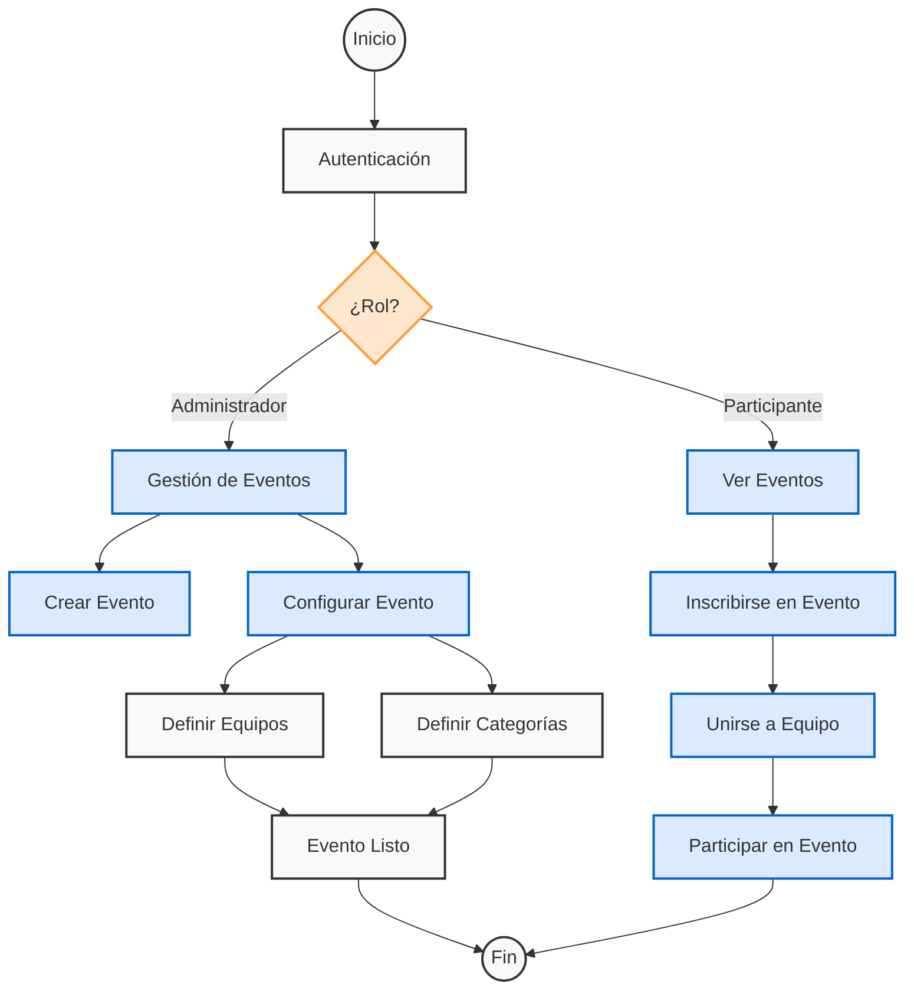
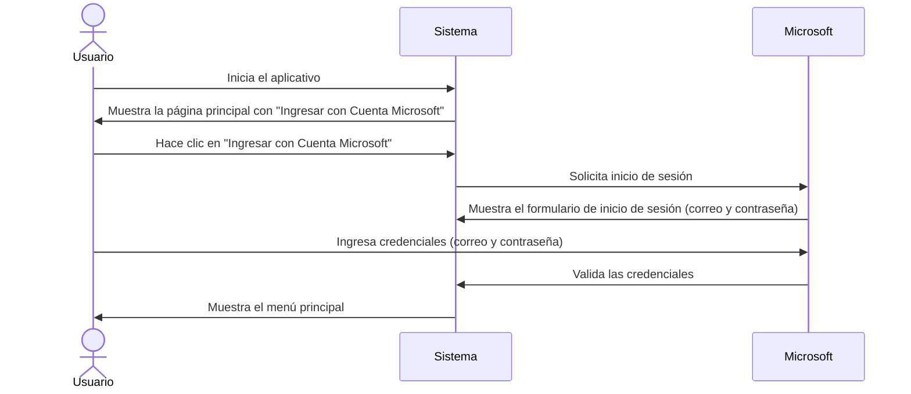
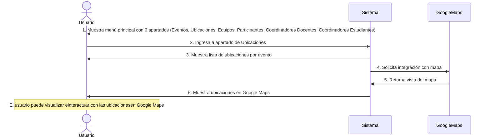
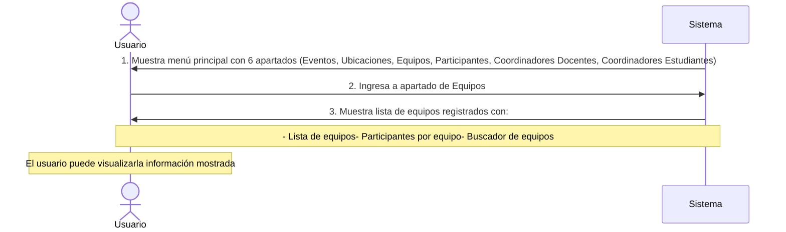
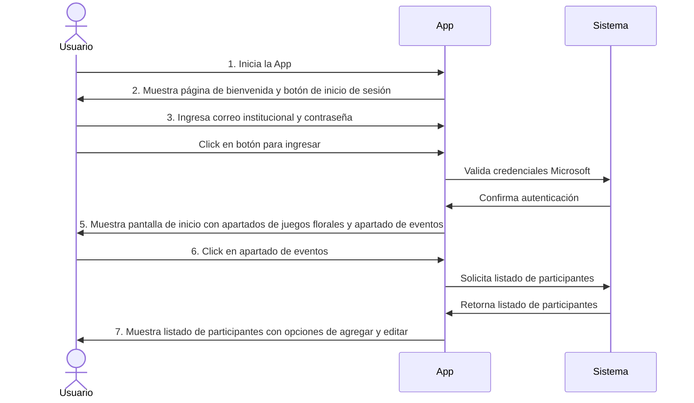
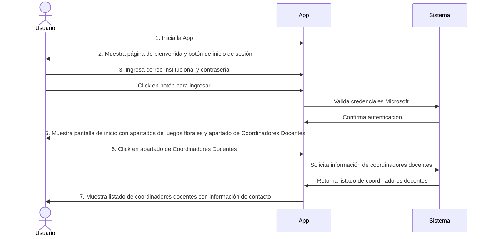
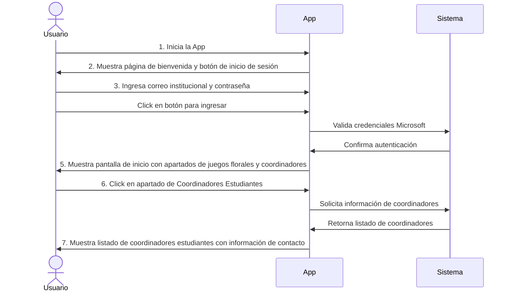

**UNIVERSIDAD PRIVADA DE TACNA**
**FACULTAD DE INGENIERÍA**
**Escuela Profesional de Ingeniería de Sistemas**

**Proyecto “Aplicativo Movil Juegos Florales”**

**Curso:** Tópicos de Bases de Datos Avanzados

**Docente:** Patrick José Cuadros Quiroga

# **Integrantes:**

Arenas Paz Soldan, Miguel Jesus (2017059282)

Lizárraga Pomareda, Sergio Pedro (2020066921)

**Tacna - Perú 2024**

|CONTROL DE VERSIONES||||||
| :-: | :- | :- | :- | :- | :- |
|Versión|Hecha por|Revisada por|Aprobada por|Fecha|Motivo|
|1\.0||||Versión 1.0|

**App Móvil de Juegos Florales**
Documento SRS
Versión 1.0

# **Índice**
1. [**Generalidades de la empresa	4**](#_toc_250006)
   1. Nombre de la Empresa:	4
   1. Visión:	4
   1. Misión:	4
1. [**Visionamiento de la Empresa	5**](#_toc_250005)
   1. Descripción del Problema:	5
   1. Objetivos de Negocios:	5
   1. Objetivos de Diseño:	5
   1. Alcance del proyecto:	5
   1. Viabilidad del Sistema:	6
   1. Información obtenida del Levantamiento de Información	6
1. [**Análisis de Procesos	6**](#_toc_250004)
1) Diagrama del Proceso Actual – Diagrama de actividades:	6
1) Diagrama del Proceso Propuesto – Diagrama de actividades Inicial:	7
1. [**Especificación de requerimientos de software	9**](#_toc_250003)
1) Cuadro de Requerimientos funcionales Inicial:	9
1) Cuadro de Requerimientos No funcionales:	10
1) Cuadro de Requerimientos funcionales Final:	11
1) Reglas de Negocio:	12
1. [**Fase de Desarrollo	12**](#_toc_250002)
   1. Perfiles de Usuario	12
   1. Modelo Conceptual:	13

[**Conclusiones	38**](#_toc_250001)

[**Recomendaciones	38**](#_toc_250000)

**Informe de SRS**

1. ### **Generalidades de la empresa**

1. Nombre de la Empresa:
   0. Para este punto hemos decidido darle el nombre a nuestra empresa como: “Transfer Sac”.

1. Visión:
   0. Ser la plataforma líder en proporcionar aplicaciones con buena escalabilidad y siguiendo el patrón correcto para una buena experiencia del usuario.

1. Misión:

Facilitar la inscripción y gestión de equipos participantes en los juegos de actividades florales universitarias a través de un aplicativo móvil, promoviendo la eficiencia, la accesibilidad y la organización en los procesos, con el objetivo de enriquecer la experiencia de los usuarios y fomentar la participación activa en las actividades estudiantiles.

1. Organigrama:

| **Categoría**              | **Responsabilidades**                                                                                                                                                    | 
|----------------------------|-------------------------------------------------------------------------------------------------------------------------------------------------------------------------|
| **Administrador**           | - Coordinador General: Encargado de supervisar y coordinar todas las actividades del proyecto.   - Coordinador Técnico: Responsable de la dirección técnica y el desarrollo de la plataforma web. | 
| **Desarrollo**              | - Desarrollador Frontend: Encargado del desarrollo de la interfaz de usuario y la experiencia del usuario en el lado del cliente.   - Desarrollador Backend: Responsable del desarrollo de la lógica del negocio, la base de datos y la funcionalidad del servidor.   - Desarrolladores Adicionales: Según sea necesario, pueden ser asignados para acelerar el desarrollo o abordar áreas específicas del proyecto. |       
| **Contenido y Comunidad**  | - Gestores de Contenido: Encargados de la creación y curación de contenido relevante para los usuarios, incluyendo descripciones de destinos, reseñas y recomendaciones.   - Moderadores de Comunidad: Responsables de mantener un entorno seguro y colaborativo en la plataforma, gestionando interacciones y resolviendo disputas. |
| **Operaciones**             | - Gerente de Operaciones: Responsable de la gestión diaria del negocio, incluyendo aspectos financieros, legales y administrativos.                                      |

1. ### **Visionamiento de la Empresa**

1. Descripción del Problema:

   El proceso de inscripción de equipos para los juegos de actividades florales universitarias se realiza manualmente, generando ineficiencias como pérdida de tiempo, errores en los registros, falta de accesibilidad y dificultades en el seguimiento de los equipos inscritos.

1. Objetivos de Negocios:
- Mejorar la gestión de inscripciones y seguimiento de equipos participantes.
- Incrementar la participación estudiantil mediante un sistema accesible y fácil de usar.
- Optimizar los recursos administrativos al automatizar el proceso de registro.

1. Objetivos de Diseño:
- Crear un aplicativo móvil intuitivo y funcional que permita la inscripción ágil de equipos.
- Implementar una interfaz amigable que facilite la navegación y el acceso a la información de los juegos.
- Garantizar la seguridad de los datos ingresados en el sistema.

1. Alcance del proyecto:

   El aplicativo móvil permitirá a los equipos universitarios registrarse, gestionar sus datos y consultar la información relacionada con los juegos de actividades florales. Incluirá funcionalidades para el seguimiento de inscripciones, notificaciones sobre eventos y estadísticas de participación.

1. Viabilidad del Sistema:
- Técnica: El desarrollo del aplicativo móvil utilizará tecnologías ampliamente adoptadas como Flutter o React Native, garantizando compatibilidad en plataformas iOS y Android.
- Económica: Los costos se centran en el desarrollo inicial, pruebas y mantenimiento, siendo factible dentro del presupuesto universitario.
- Operativa: Los usuarios (estudiantes y organizadores) podrán operar el sistema fácilmente con capacitación mínima, asegurando una rápida adopción.

1. Información obtenida del Levantamiento de Información
- Identificación de problemas en el proceso actual, como registros manuales y la falta de centralización de datos.
- Requerimientos funcionales y no funcionales del sistema móvil, basados en entrevistas con estudiantes y organizadores.
- Preferencia por un diseño visual acorde a la temática universitaria y un enfoque práctico para usuarios no técnicos.
1. ### **Análisis de Procesos**
1) Diagrama del Proceso Actual – Diagrama de actividades:

1) Diagrama del Proceso Propuesto – Diagrama de actividades Inicial:

1. ### **Especificación de requerimientos de software**

1) Cuadro de Requerimientos funcionales Inicial:

| **ID**  | **Requerimiento**        | **Descripción**                                                                                              |
|:-------:|:------------------------:|:------------------------------------------------------------------------------------------------------------:|
| **RF1** | **Autenticación y Usuarios** | - Inicio de sesión mediante cuentas Microsoft   - Roles diferenciados (administrador y usuario estándar)   - Cierre de sesión seguro |
| **RF2** | **Gestión de Eventos**    | - Crear, editar, eliminar y visualizar eventos   - Asignar fechas y ubicaciones a eventos   - Gestionar estados de eventos |
| **RF3** | **Gestión de Participantes** | - Registro y administración de participantes   - Asignación de participantes a eventos   - Control de información personal |

1) Cuadro de Requerimientos No funcionales:

| **ID**  | **Requerimiento** | **Descripción**                                                                                                                                      |
|:-------:|:-----------------:|:----------------------------------------------------------------------------------------------------------------------------------------------------:|
| **RNF1** | **Seguridad**      | - Autenticación segura con Microsoft   - Protección de datos personales   - Control de acceso basado en roles                                 |
| **RNF2** | **Usabilidad**     | - Interfaz intuitiva y responsive   - Tiempos de respuesta rápidos   - Diseño adaptable a diferentes dispositivos                              |
| **RNF3** | **Rendimiento**    | - Carga rápida de datos   - Optimización de recursos   - Manejo eficiente de la memoria                                                      |
| **RNF4** | **Mantenibilidad** | - Código modular y documentado   - Facilidad de actualización   - Gestión de versiones                                                       |

1) Cuadro de Requerimientos funcionales Final:

|**ID**|**Requerimiento**|**Descripción**|
| :-: | :-: | :-: |
|

RF1
|

Autenticación y Usuarios
|
- Inicio de sesión mediante cuentas Microsoft

- Roles diferenciados (administrador y usuario estándar)

- Cierre de sesión seguro
|
|

RF2
|

Gestión de Eventos
|
- Crear, editar, eliminar y visualizar eventos

- Asignar fechas y ubicaciones a eventos

- Gestionar estados de eventos
|
|

RF3
|

Gestión de Participantes
|
- Registro y administración de participantes

- Asignación de participantes a eventos

- Control de información personal
|
|

RF4
|

Gestión de Equipos
|
- Crear y administrar equipos

- Asignar participantes a equipos

- Vincular equipos con eventos
|
|

RF5
|

Gestión de Ubicaciones
|
- Registro de ubicaciones para eventos.

- Detalles y disponibilidad de espacios.

- Asignación de ubicaciones a eventos
|

1) Reglas de Negocio:

   - Los usuarios deben estar registrados en la Universidad.

   - Los usuarios deben cumplir con las normas de la comunidad y no publicar contenido inapropiado o spam.

   - Los anuncios publicados en la app son meramente informativos sin el fin de obligar a alguien.

   - La plataforma puede ofrecer funciones premium o publicidad para generar ingresos, pero debe mantener la integridad y la objetividad en la presentación de recomendaciones.

1. ### **Fase de Desarrollo**

1. Perfiles de Usuario
   0. Alumno:
      0. Descripción: Amante de la aventura y la exploración, dispuesto a descubrir destinos menos conocidos y experiencias auténticas.
      0. Comportamiento:	Busca	destinos	fuera	de	lo	común, actividades al aire libre y restaurantes locales auténticos.

0. Participante:
   0. Descripción: Originario del lugar o poblador de la zona que conozca bien su ciudad.
   0. Comportamiento: Busca destinos fuera de lo común, postear, recomendar nuevos lugares.

1. Modelo Conceptual:
   0. Diagrama de Paquetes:

0. Diagrama de Casos de Uso:

   

0. Escenarios de Caso de Uso (narrativa):

\-	Requerimiento RF-1: Iniciar Sesión

|**Caso de Uso**|**Iniciar Sesión**|
| :- | :- |
|**Actores**|Miembro UPT|
|**Descripción**|Inicio de sesión con cuenta Microsoft para que solo estudiantes de la UPT puedan acceder al sistema.|
|**Precondición**|El usuario debe tener las credenciales de su cuenta de microsoft para poder acceder.|
|**Curso Normal de los Eventos**||
|**Acción del Actor**|**Respuesta del Sistema**|
|1\. El usuario inicia el aplicativo.||
||2\. El sistema mostrará la página principal con el botón “Ingresar con Cuenta Microsoft”.|

|3\. El usuario da clic en el botón||
| :- | :- |
||4\. El sistema muestra el inicio de sesión de microsoft, correo y contraseña.|
|5\. El usuario ingresa sus credenciales de su cuenta de microsoft.||
||
6\. El sistema valida las credenciales y muestra

la pantalla del menú principal.
|
|**Postcondición**|
El usuario podrá visualizar el menú principal de

la aplicación para poder interactuar con ella.
|

- Requerimiento RF-2: Visualizar Eventos

|**Caso de Uso**|**Visualizar Eventos**|
| :- | :- |
|**Actores**|Miembro UPT|
|**Descripción**|
El usuario dependiendo del rol podrá visualizar la

información, y si fuera administrador, podrá agregar y editar la información que se muestra.
|
|**Precondición**|
El usuario debió haber iniciado sesión con sus

credenciales de microsoft.
|
|**Curso Normal de los Eventos**||
|**Acción del Actor**|**Respuesta del Sistema**|
||1\. El sistema muestra la pantalla del menú principal con 6 apartados: Eventos, Ubicaciones, Equipos, Participantes, Coordinadores Docentes, Coordinadores Estudiantes.|
|2\. El usuario ingresa a Eventos.||
||3\. El sistema le muestra los distintos eventos que se encuentran dentro de este apartado, se detalla cada evento como el, nombre, descripción,etc.|
|**Postcondición**|
El usuario podrá visualizar la información que se

ha mostrado.
|

- Requerimiento RF-3: Visualizar Ubicaciones

|**Caso de Uso**|**Visualizar Ubicaciones**|
| :- | :- |
|**Actores**|Miembro UPT|
|**Descripción**|
El usuario dependiendo del rol podrá visualizar la

información, y si fuera administrador, podrá agregar y editar la información que se muestra.
|
|**Precondición**|
El usuario debió haber iniciado sesión con sus

credenciales de microsoft.
|
|**Curso Normal de los Eventos**||
|**Acción del Actor**|**Respuesta del Sistema**|
||1\. El sistema muestra la pantalla del menú principal con 6 apartados: Eventos, Ubicaciones, Equipos, Participantes, Coordinadores Docentes, Coordinadores Estudiantes.|
|2\. El usuario ingresa a Ubicaciones.||
||3\. El sistema le muestra las distintas ubicaciones de los eventos que se llevarán a cabo, listará cada evento con su ubicación respectiva y tendrá un|

||
botón para poder abrir Google Maps y que el

usuario tenga una mejor guía.
|
| :- | :- |
|**Postcondición**|
El usuario podrá visualizar la información que se ha mostrado y podrá interactuar con la ubicación

mostrada en Google Maps.
|

- Requerimiento RF-4: Visualizar Equipos

|**Caso de Uso**|**Visualizar Equipos**|
| :- | :- |
|**Actores**|Miembro UPT|
|**Descripción**|El usuario dependiendo del rol podrá visualizar la información, y si fuera administrador, podrá agregar y editar la información que se muestra.|
|**Precondición**|
El usuario debió haber iniciado sesión con sus

credenciales de microsoft.
|
|**Curso Normal de los Eventos**||
|**Acción del Actor**|**Respuesta del Sistema**|
||1\. El sistema muestra la pantalla del menú principal con 6 apartados: Eventos, Ubicaciones, Equipos, Participantes, Coordinadores Docentes, Coordinadores Estudiantes.|
|2\. El usuario ingresa a Equipos.||
||3\. El sistema le muestra la lista de equipos que se encuentren registrados, junto a eso se muestra también dentro de cada equipo, los participantes que pertenecen a dicho equipo, incluye también un buscador para que el usuario pueda encontrar de mejor manera a cualquier equipo.|
|**Postcondición**|
El usuario podrá visualizar la información que se

ha mostrado.
|

- Requerimiento RF-5: Visualizar Participantes.

|**Caso de Uso**|**Visualizar Participantes.**|
| :- | :- |
|**Actores**|Miembro UPT.|
|**Propósito**|Tener un apartado de participantes ayuda a ver a los alumnos involucrados en los juegos.|
|**Descripción**|
El sistema debe mostrar el apartado de los participantes que los liste y nos permite agregar

y modificar.
|
|**Precondición**|El usuario debió haber iniciado sesión con sus credenciales de microsoft.|
|**Curso Normal de los Eventos**||
|**Acción del Actor**|**Respuesta del Sistema**|
|1\. El usuario inicia la App.||
||2\. La App mostrará una página de bienvenida y el botón para iniciar sesión.|
|3\. El usuario ingresa su correo institucional y||

|contraseña y da clic en el botón para ingresar.||
| :- | :- |
||
5\. La App mostrará la pantalla de inicio con los diversos apartados de los juegos florales, siendo uno de estos los eventos, que se encontrará como primer apartado en la esquina

superior izquierda.
|
|3\. El usuario da clic en el apartado de eventos.||
||4\. La App mostrará el listado de los participantes con sus datos y las opciones de agregar y editar.|
|**Postcondición**|
El usuario podrá ver e interactuar con el listado

de los participantes.
|

- Requerimiento RF-6: Visualizar Coordinadores Docentes.

|**Caso de Uso**|**Visualizar Coordinadores Docentes.**|
| :- | :- |
|**Actores**|Miembro UPT.|
|**Propósito**|Tener un apartado de Coordinadores docentes ayuda a ver a los alumnos o participantes a obtener más información y detalles de los juegos.|
|**Descripción**|
El sistema debe mostrar el apartado de los

coordinadores docentes que los liste para su información de contacto.
|
|**Precondición**|
El usuario debió haber iniciado sesión con sus

credenciales de microsoft.
|
|**Curso Normal de los Eventos**||
|**Acción del Actor**|**Respuesta del Sistema**|
|1\. El usuario inicia la App.||
||2\. La App mostrará una página de bienvenida y el botón para iniciar sesión.|
|
3\. El usuario ingresa su correo institucional y

contraseña y da clic en el botón para ingresar.
||
||
5\. La App mostrará la pantalla de inicio con los diversos apartados de los juegos florales, siendo uno de estos los Coordinadores Docentes, que se encontrará como penúltimo apartado en la

esquina inferior izquierda.
|
|
3\. El usuario da clic en el apartado de

Coordinadores Docentes.
||
||4\. La App mostrará el listado de los coordinadores docentes con su información de contacto|
|**Postcondición**|
El usuario podrá contactar a los coordinadores

docentes por medio de su número.
|

- Requerimiento RF-7: Visualizar Coordinadores Estudiantes.

|**Caso de Uso**|**Visualizar Coordinadores Estudiantes.**|
| :- | :- |
|**Actores**|Miembro UPT.|
|**Propósito**|
Tener un apartado de Coordinadores estudiantes ayuda a los participantes a tener más

disponibilidad de contactos.
|
|**Descripción**|
El sistema debe mostrar el apartado de los coordinadores estudiantes que los liste para su

información de contacto.
|
|**Precondición**|El usuario debió haber iniciado sesión con sus credenciales de microsoft.|
|**Curso Normal de los Eventos**||
|**Acción del Actor**|**Respuesta del Sistema**|
|1\. El usuario inicia la App.||
||2\. La App mostrará una página de bienvenida y el botón para iniciar sesión.|
|
3\. El usuario ingresa su correo institucional y

contraseña y da clic en el botón para ingresar.
||
||
5\. La App mostrará la pantalla de inicio con los diversos apartados de los juegos florales, siendo uno de estos los Coordinadores Estudiantes, que se encontrará como último apartado en la

esquina inferior derecha.
|
|3\. El usuario da clic en el apartado de Coordinadores Estudiantes.||
||
4\. La App mostrará el listado de los

coordinadores estudiantes con su información de contacto
|
|**Postcondición**|
El usuario podrá contactar a los coordinadores

estudiantes por medio de su número.
|

### **Conclusiones**
- Complejidad del Sistema: El modelo lógico refleja la complejidad inherente de una plataforma, que involucra múltiples objetos y relaciones entre ellos, como usuarios, destinos, actividades y puntuaciones.

- Interacción de Usuarios: Los diferentes casos de uso y objetos identificados muestran la variedad de interacciones que los usuarios pueden tener con la plataforma.

- Enfoque en la Experiencia del Usuario: El análisis de objetos y los diagramas de actividades y secuencia destacan la importancia de centrarse en la experiencia del usuario al diseñar la plataforma, asegurando que las funcionalidades sean intuitivas y fáciles de usar.

- Gestión de Contenido: La plataforma deberá implementar un sistema robusto de gestión de contenido para administrar la información garantizando su precisión y relevancia para los usuarios.

### **Recomendaciones**
- Pruebas de Usabilidad: Realizar pruebas de usabilidad con usuarios reales para evaluar la facilidad de uso y la eficacia de la plataforma, identificando áreas de mejora en la interfaz de usuario y la navegación.

- Refinamiento Continuo: Mantener un proceso de desarrollo iterativo para iterar y mejorar continuamente la plataforma en función del feedback de los usuarios y los cambios en las tendencias del mercado.

- Seguridad de la Información: Implementar medidas de seguridad sólidas para proteger la información del usuario, como el cifrado de datos y la autenticación segura, garantizando la privacidad y la confidencialidad de los datos.

- Promoción y Marketing: Desarrollar estrategias de promoción y marketing efectivas para atraer a nuevos usuarios y promover la participación en la plataforma, aprovechando las redes sociales y las asociaciones locales.

- Escalabilidad: Diseñar la plataforma con la capacidad de escalar fácilmente para manejar un aumento en el número de usuarios y la carga de trabajo a medida que crece la base de usuarios y la plataforma se vuelve más popular.
